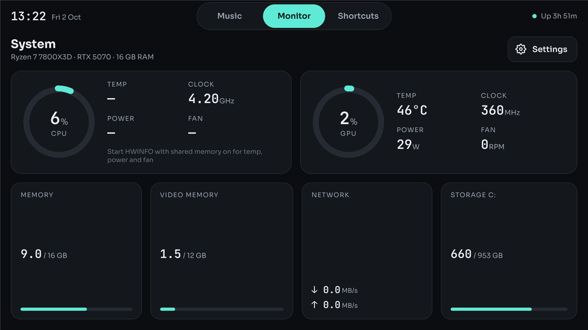
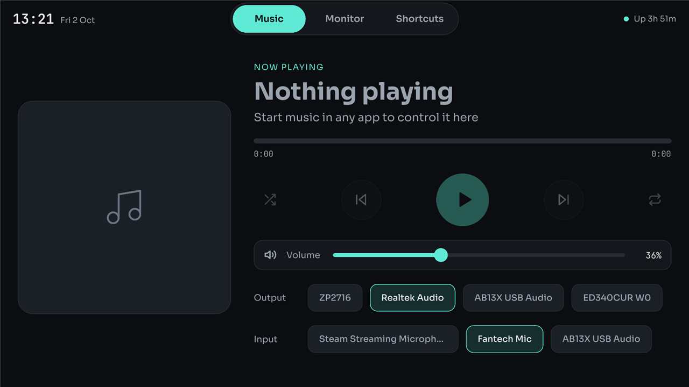
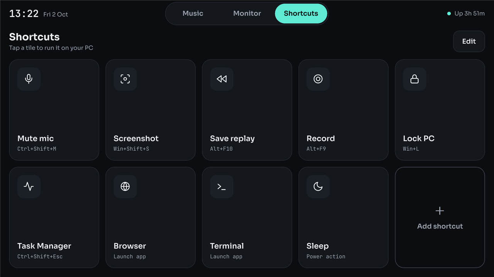
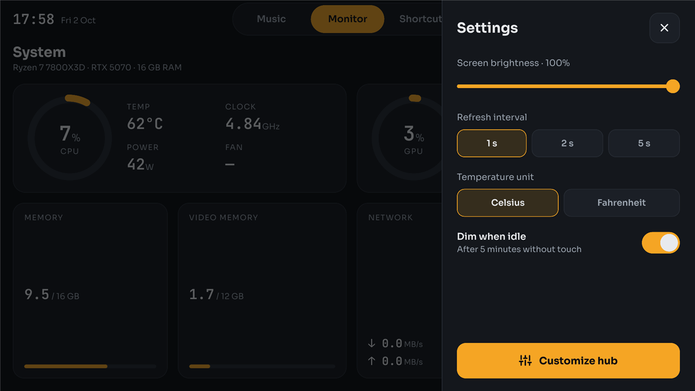
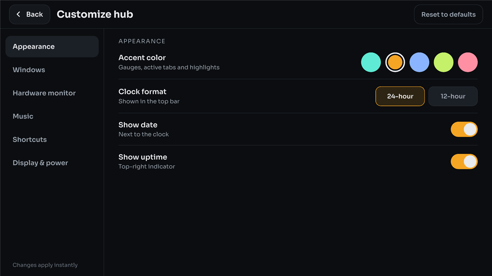

# PC Hub

A touch dashboard for a small secondary screen next to your PC. Three pages you swipe
between: music and audio controls, a live hardware monitor, and a grid of shortcut tiles.
Built with Rust and [Slint](https://slint.dev) for Windows.



| Music | Shortcuts |
|---|---|
|  |  |
| **Settings** | **Customize hub** |
|  |  |

## Features

**Music**
- Now playing from any app that shows up in the Windows volume flyout (Spotify, browsers,
  most media players), with album art, track progress and elapsed/total time
- Play/pause, previous, next, shuffle and repeat (greyed out when the app doesn't support them)
- System volume slider
- One-tap switching of the default **output** device (speakers, headphones, monitors)
  and **input** device (microphones)

**Monitor**
- Processor and graphics card load gauges, with temperature, clock, power and fan speed
- Memory, video memory, network speed and system drive usage
- Temperatures in Celsius or Fahrenheit; turn amber when running hot

**Shortcuts**
- Tiles that press a key combination (Discord mute, NVIDIA replay, Snipping Tool),
  lock or sleep the PC, or open any app, file, folder, website or settings page
- Edits to the tiles show up within two seconds, without restarting

**Customize hub**
- A full-screen settings window, all adjustable by touch and applied instantly:
  accent color (five presets, or any hex code typed on an on-screen keypad), 12/24-hour clock, which pages and Monitor cards appear, the page it
  opens on, swipe and slide animation, the heat-warning temperature, album art and
  device buttons, key-combination hints, brightness, idle dimming, and going dark
  while the PC is locked

**Everywhere**
- Tapping the hub never takes focus away from the app in front, so full-screen games
  stay put and key-combination tiles reach them
- Opens full screen on the screen you choose

## Requirements

- Windows 10 or 11
- A second screen for the hub. A touch screen works best, but a mouse works too
- Optional: [HWiNFO](https://www.hwinfo.com) for processor temperature, power and fan speed
- Optional: an NVIDIA graphics card for graphics card readings

## Getting started

### 1. Build it

You need Rust (install from https://rustup.rs) and the Microsoft C++ build tools, which
Rust uses for linking on Windows:

```
winget install Microsoft.VisualStudio.2022.BuildTools --override "--wait --passive --add Microsoft.VisualStudio.Workload.VCTools --includeRecommended"
```

Then get the code and build it:

```
git clone https://github.com/sudpmishra/PC-Hub.git
cd PC-Hub
cargo run              # try it out; keeps a console window open for log messages
cargo build --release  # the finished app, at target\release\pc-hub.exe
```

The first build takes a few minutes; after that, rebuilds take seconds.

### 2. Point it at your touch screen

Out of the box the hub opens on your main screen. To move it to the touch screen, open
`hub.toml`, uncomment `x` and `y` under `[window]` and set them to the top-left corner of
the touch screen in Windows desktop coordinates (physical pixels). Settings > System >
Display shows how your screens are arranged. For example, for a touch screen to the right
of a 1920-pixel-wide main monitor, `x` is 1920, and `y` is how far down its top edge sits
(0 if the tops line up).

If touches land on the wrong monitor, open Control Panel > Tablet PC Settings > Setup
and tap the touch screen when prompted.

### 3. Install it

1. Make a folder, such as `C:\Tools\PC Hub`.
2. Copy `target\release\pc-hub.exe` and `hub.toml` into it. The hub reads `hub.toml` from
   its own folder first (then from the current folder), and saves its settings beside it.
3. To start it with Windows: press Win+R, type `shell:startup`, and put a shortcut to
   `pc-hub.exe` in the folder that opens.

### 4. Turn on processor sensors (optional)

Windows has no standard way to read processor temperature, power or fan speed, so the hub
takes them from [HWiNFO](https://www.hwinfo.com). Until HWiNFO is running, those readings
show "—" and the processor card says so.

1. Install HWiNFO64 and start it in **Sensors-only** mode.
2. Open its settings and tick **Shared Memory Support**.
3. To have it start with Windows, also tick **Auto Start** and **Minimize Sensors on Startup**.

The free version of HWiNFO switches shared memory off after 12 hours; tick it again
or restart HWiNFO when the readings go back to "—".

HWiNFO also provides the processor's real working clock (the average across cores).
Without it, the clock shown is the one Windows reports, which is often the base clock.

The processor fan is found by looking for "CPU" in its name. Many motherboards call it
something like "System 1" instead; find it in HWiNFO's sensor list and name it in
`hub.toml`:

```toml
[sensors]
cpu_fan = "System 1"
```

Graphics card readings need nothing extra on NVIDIA cards: they come from the driver.
Other brands show "—".

## Using it

- **Switch pages** by tapping Music, Monitor or Shortcuts at the top, or swiping left
  or right anywhere. The hub opens on Monitor.
- **Music:** start something playing in any app and it appears here. Tap a device under
  Output or Input to make it the Windows default; the highlighted one is current.
- **Settings:** tap Settings on the Monitor page for brightness, refresh interval,
  temperature unit and idle dimming. Tap outside the sheet or the X to close it.
- **Customize hub:** the button at the bottom of the Settings sheet opens every option,
  grouped into Appearance, Windows, Hardware monitor, Music, Shortcuts, and Display &
  power. **Back** returns to the hub; **Reset to defaults** undoes everything.
  **Close hub** (under Display & power) quits the app.
- **Shortcuts:** tap a tile to run it; the line under the page title confirms what ran.
  **Edit** and **Add shortcut** open the Shortcuts section of Customize hub, where each
  tile's Edit button opens `hub.toml` in Notepad. Save it and the tiles update.
- **Dimmed screen:** after the idle time (5 minutes by default) without a touch, the
  screen darkens. The first tap only wakes it. With "Screen off when PC locks" on, it
  also goes dark while Windows is locked.

## Configuration

Everything lives in `hub.toml`. Shortcut changes apply on save; restart the hub for the rest.

```toml
columns = 5              # shortcut tiles per row
accent = "#5EEAD4"       # highlight color, unless another is picked on the hub

[window]
x = 1920                 # top-left corner of the touch screen; leave out for the main screen
y = 0
fullscreen = true
```

### Output and input buttons

By default the Music page shows up to four connected devices of each kind. To choose which
ones appear and what they're called, list them. `device` is any part of the name Windows
shows in Settings > System > Sound; devices that aren't plugged in are hidden.

```toml
[[output]]
label = "Speakers"
device = "Realtek"

[[output]]
label = "Headphones"
device = "USB Audio"

[[input]]
label = "Desk mic"
device = "Microphone"
```

### Shortcuts

Each `[[shortcut]]` does one of three things:

```toml
[[shortcut]]
label = "Mute mic"
icon = "mic"
keys = "Ctrl+Shift+M"            # press a key combination

[[shortcut]]
label = "Lock PC"
icon = "lock"
action = "lock"                  # built-in action: "lock" or "sleep"

[[shortcut]]
label = "Sound settings"
icon = "speaker"
run = "ms-settings:sound"        # open an app, file, folder, website or URI
# args = ["--flag", "value"]     # optional arguments for run
```

- **keys**: names joined with `+`. Modifiers `Ctrl`, `Shift`, `Alt`, `Win`; letters and
  digits; `F1` to `F24`; `Esc`, `Enter`, `Space`, `Tab`, `Backspace`, `Delete`, `Insert`,
  `Home`, `End`, `PageUp`, `PageDown`, arrow keys (`Left`, `Right`, `Up`, `Down`),
  `PrintScreen`, `Pause`; media keys `PlayPause`, `NextTrack`, `PrevTrack`, `Mute`,
  `VolumeUp`, `VolumeDown`. Hotkeys that apps register globally (Discord, NVIDIA overlay,
  Win+Shift+S) work no matter what's in front. Windows doesn't let programs press Win+L,
  which is why locking is an `action`.
- **icon**: `mic`, `mic-off`, `screenshot`, `replay`, `record`, `lock`, `activity`, `globe`,
  `terminal`, `moon`, `music`, `chat`, `game`, `folder`, `settings`, `speaker`, `power`.
  Anything else gets a generic app icon.
- **hint**: optional small text under the label. Defaults to the key combination,
  "Power action" for sleep, or "Launch app".

### Settings made on the hub

Everything on the Settings sheet and the Customize hub screen is saved to
`hub-settings.toml` beside `hub.toml`. Use **Reset to defaults** on the hub, or delete
the file, to start over.

## Troubleshooting

| Problem | Fix |
|---|---|
| `cargo` is not recognized | Restart VS Code or the terminal after installing Rust, or run `%USERPROFILE%\.cargo\bin\cargo.exe` directly |
| `linker link.exe not found` | Install the C++ build tools (see Build it) |
| The hub opens on the wrong screen | Check `x` and `y` in `hub.toml` against Settings > System > Display |
| Processor temperature, power and fan show "—" | Start HWiNFO with Shared Memory Support (see step 4). If only the fan is missing, set `cpu_fan` |
| Shared Memory Support is on but nothing shows | Exit HWiNFO from its tray icon and start it again |
| Shuffle or repeat are greyed out | The playing app doesn't let Windows control them (Spotify is one) |
| A device is missing under Output or Input | Only four fit; list the ones you want with `[[output]]` / `[[input]]` |
| A key-combination tile does nothing | Check the target app's hotkey matches, and that it works when pressed on the keyboard |
| Error messages | Run with `cargo run`, or start a debug build from a terminal: release builds have no console |

## Project layout

| File | What it does |
|---|---|
| `ui/app.slint` | All of the layout, colors and touch behavior |
| `ui/fonts/` | Sora and JetBrains Mono (SIL Open Font License), built into the .exe |
| `src/main.rs` | Wires the UI to the data sources and runs the clock and sensor timer |
| `src/stats.rs` | Processor, memory, network and disk readings |
| `src/gpu.rs` | NVIDIA graphics card readings |
| `src/hwinfo.rs` | Processor temperature, power and fan from HWiNFO |
| `src/media.rs` | Now playing, album art and playback control through Windows media sessions |
| `src/audio.rs` | Volume and output/input device switching |
| `src/actions.rs` | Key presses, lock and sleep for shortcuts; keeps the window from taking focus |
| `src/config.rs` | Loads `hub.toml` and launches shortcuts |
| `src/settings.rs` | Saves the choices made on the Settings sheet and Customize hub screen |
| `src/icons.rs` | Icons for shortcut tiles |

For live UI editing, install the Slint extension for VS Code: it previews `app.slint`
as you type, without rebuilding.

## Roadmap

- Tiles that show on/off state, such as whether the mic is muted
- Different shortcut pages for gaming and work

## Contributing

Bug reports, ideas and pull requests are welcome. Please open an issue first for larger
changes so we can talk about the approach.

## License

[MIT](LICENSE). The bundled Sora and JetBrains Mono fonts are under the SIL Open Font License
([Sora](ui/fonts/OFL-Sora.txt), [JetBrains Mono](ui/fonts/OFL-JetBrainsMono.txt)).
